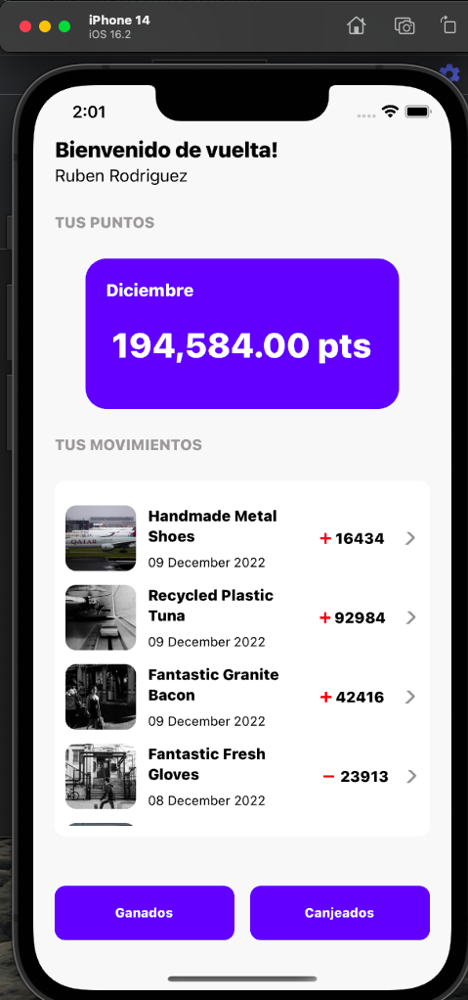

# DigitalHouseTest

  ## mobile app for the Digital house technical test. 
  
  ### Installing
    -   Install dependencies with `npm install`
    -   For iOS, must run the following command to install the Pods : `cd ios/` & then run `pod install`
  
  
  ### here some pics
    
